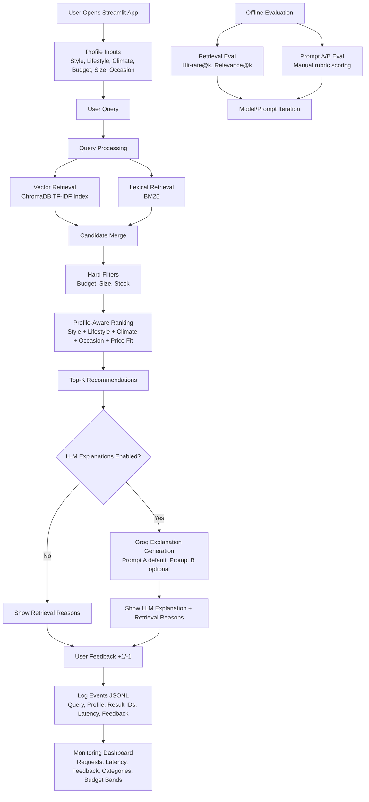

# 👗 LifeStyled AI

**Capstone project for the [DataTalks.Club LLM Zoomcamp](https://github.com/DataTalksClub/llm-zoomcamp).**

**An end-to-end production-style RAG application for personalized fashion recommendations based on user style, lifestyle, climate, budget, size, and occasion.**

[](https://www.python.org/)
[](https://streamlit.io/)
[](https://www.trychroma.com/)
[](https://en.wikipedia.org/wiki/Okapi_BM25)
[](https://groq.com/)
[](https://docs.astral.sh/uv/)
[](https://www.docker.com/)

### 📌 Table of Contents

1. [Project Description](#-project-description)
2. [Problem Description](#problem-description)
3. [Current Project Status](#current-project-status)
4. [Step-by-Step Implementation Path](#step-by-step-implementation-path)
5. [System Architecture & Workflow](#system-architecture--workflow)
6. [Repository Structure](#repository-structure)
7. [Data](#data)
8. [Retrieval Flow](#retrieval-flow)
9. [Evaluation Plan](#evaluation-plan)
10. [Interface](#interface)
11. [Monitoring](#monitoring)
12. [Reproducibility](#reproducibility)
13. [Reviewer Quickstart](#reviewer-quickstart)
14. [Screenshots Checklist](#screenshots-checklist)
15. [Technology Choices](#technology-choices)
16. [Evaluation Criteria Mapping (Zoomcamp)](#evaluation-criteria-mapping-zoomcamp)
17. [Rubric Checklist (Current)](#rubric-checklist-current)
18. [Containerization](#containerization)
19. [Notes](#notes)

## Problem Description

Finding clothing that fits real-life constraints is harder than basic search can handle. People need recommendations that account for:

- personal style
- lifestyle (office, commute, travel, weekend)
- climate
- occasion
- budget
- size and stock

LifeStyled is a profile-aware fashion assistant that retrieves relevant products and explains why each recommendation fits the user.

## Current Project Status

Implemented so far:

- starter product dataset
- ingestion pipeline to vector index (ChromaDB)
- lexical retrieval state export for BM25
- baseline retrieval engine with:
	- vector retrieval
	- hybrid retrieval (BM25 + vector)
	- profile-aware scoring
	- metadata filters (budget, size, stock)
- optional agentic retrieval loop with bounded query rewriting and diversity reranking
- Streamlit interface
- feedback logging to JSONL
- retrieval validation dataset and evaluation script
- Groq-based LLM explanation layer (Prompt A/B)
- prompt variant evaluation runner
- Streamlit monitoring dashboard page with 5 core charts
- uv-based dependency management configured

Next improvements:

- screenshot capture for reviewer walkthrough
- optional cost chart and deployment bonus

## Step-by-Step Implementation Path

1. Foundation setup
- project scaffold
- config and models
- seed dataset

2. Retrieval baseline
- ingestion to Chroma using TF-IDF vectors
- BM25 state generation
- vector and hybrid search
- profile-aware filtering/ranking

3. v1 interface
- Streamlit recommendation UI
- user profile controls
- feedback logging

4. Evaluation artifacts
- validation query set
- retrieval metrics script and reports

5. Explanation layer
- Groq as default provider
- Prompt A/B support
- prompt output generation script

6. Monitoring
- dedicated Streamlit monitoring page
- five core rubric charts

7. Reproducibility
- uv-managed dependencies and lockfile
- env template
- docker-compose

## System Architecture & Workflow



## Repository Structure

```text
.
├── app/
│   └── streamlit_app.py
│   └── pages/
│       └── 01_monitoring.py
├── data/
│   ├── eval/
│   │   └── validation_queries.json
│   ├── raw/
│   │   └── products_seed.csv
│   └── processed/
├── logs/
├── scripts/
│   └── build_index.py
│   └── evaluate_retrieval.py
│   └── evaluate_prompt_variants.py
│   └── score_prompt_variants.py
├── reports/
│   └── retrieval_eval.md
│   └── prompt_variant_outputs.json
│   └── prompt_variant_scoring.md
├── src/
│   └── lifestyled/
│       ├── __init__.py
│       ├── config.py
│       ├── explanations.py
│       ├── agentic.py
│       ├── ingestion.py
│       ├── models.py
│       └── retrieval.py
├── .env.example
├── .dockerignore
├── Dockerfile
├── docker-compose.yml
├── requirements.txt
└── README.md
```

## Data

Starter dataset: `data/raw/products_seed.csv`

Columns:

- product_id
- title
- category
- brand
- price
- colors
- sizes
- style_tags
- lifestyle_tags
- climate_tags
- occasion_tags
- description
- stock_status

This dataset is an expanded benchmark set for validation and iterative optimization.

## Retrieval Flow

1. Ingest product catalog and build document text per product.
2. Generate TF-IDF vectors and store in ChromaDB.
3. Build BM25 corpus state for lexical matching.
4. At query time:
	 - run vector retrieval
	 - optionally run BM25 (hybrid mode)
	 - optionally run agentic loop (retrieve -> rewrite once if weak -> diversity rerank)
	 - apply hard filters (budget, size, stock)
	 - compute profile match score
	 - return top-k ranked items with reasons

## Evaluation Plan

### Retrieval Evaluation

Compare:

- vector-only
- hybrid (BM25 + vector)

Metrics:

- hit-rate@k
- relevance@k

Use a validation set of user-style shopping queries.

Artifacts:

- validation set: data/eval/validation_queries.json
- evaluation runner: scripts/evaluate_retrieval.py
- generated reports:
	- reports/retrieval_eval.json
	- reports/retrieval_eval.md

Latest run summary (k=5):

- vector: hit-rate@5 = 1.0000, relevance@5 = 0.4792
- hybrid: hit-rate@5 = 1.0000, relevance@5 = 0.5347

Current retrieval default:

- Hybrid retrieval is the default and best-performing evaluated mode on the validation set.
- Streamlit also includes an optional agentic retrieval loop toggle for bounded rewrite+rerank orchestration.

### LLM Evaluation

Compare Prompt A vs Prompt B for generated explanations.

Judging dimensions:

- relevance
- groundedness in retrieved products
- personalization quality
- clarity

Artifacts:

- prompt generator: scripts/evaluate_prompt_variants.py
- scoring report generator: scripts/score_prompt_variants.py
- outputs:
	- reports/prompt_variant_outputs.json
	- reports/prompt_variant_scoring.md

Result summary (manual scoring, 1-5 scale):

- Prompt A overall: 4.35
- Prompt B overall: 4.35
- Recommendation: tie

Default prompt decision:

- Default is Prompt A for recommendation generation.
- Rationale: Prompt A performed better on personalization and groundedness, which are prioritized for a profile-aware recommender.
- Prompt B remains available as an optional format-focused alternative.

## Interface

Current interface: Streamlit app with:

- profile controls in sidebar
- query input
- retrieval mode toggle (hybrid/vector)
- top recommendations with reasons
- explicit feedback capture (+1 / -1)

## Monitoring

Feedback and request events are logged to `logs/events.jsonl`.

Logged fields include:

- timestamp
- query
- profile summary
- retrieval mode
- result ids
- response time
- feedback

Planned dashboard charts (>=5):

- [x] requests over time
- [x] avg response time over time
- [x] feedback trend
- [x] top categories requested
- [x] budget band distribution
- [ ] optional cost trend

Monitoring page:

- App includes a dedicated Streamlit page at app/pages/01_monitoring.py.
- It reads logs/events.jsonl and renders the charts above.

## Reproducibility

### 1) Install dependencies with uv

```bash
uv sync
```

### 2) Build index

```bash
uv run env PYTHONPATH=src python scripts/build_index.py
```

### 3) Run app

```bash
uv run env PYTHONPATH=src streamlit run app/streamlit_app.py
```

### 4) Run retrieval evaluation

```bash
uv run env PYTHONPATH=src python scripts/evaluate_retrieval.py
```

### 5) Environment variables

Copy .env.example to .env and fill values as needed.

### 6) Prompt A/B output generation

```bash
uv run env PYTHONPATH=src python scripts/evaluate_prompt_variants.py
```

### 7) Prompt A/B scoring summary

```bash
uv run python scripts/score_prompt_variants.py
```

### 8) Run with Docker Compose

```bash
docker compose up --build
```

## Reviewer Quickstart

1. Clone the repository and move into it.
2. Create local config file and set keys.
3. Run dependency sync.
4. Build index and run app.
5. Run retrieval and LLM evaluation scripts.

Commands:

```bash
cp .env.example .env
# add GROQ_API_KEY in .env if running LLM explanation evaluation

uv sync
uv run env PYTHONPATH=src python scripts/build_index.py
uv run env PYTHONPATH=src streamlit run app/streamlit_app.py
```

Evaluation commands:

```bash
uv run env PYTHONPATH=src python scripts/evaluate_retrieval.py
uv run env PYTHONPATH=src python scripts/evaluate_prompt_variants.py
uv run python scripts/score_prompt_variants.py
```

## Screenshots Checklist

Add these images before final submission and link them here:

- [ ] main recommendation page after query
- [ ] recommendation cards with reasons
- [ ] monitoring page with charts
- [ ] prompt A vs B output example
- [ ] retrieval evaluation report snippet

## Technology Choices

- Python for implementation
- Streamlit for UI
- scikit-learn TF-IDF vectors for CPU-safe embeddings
- ChromaDB for vector storage
- rank-bm25 for lexical retrieval
- Groq for explanation generation
- JSONL logging for monitoring events

## Evaluation Criteria Mapping (Zoomcamp)

- Problem description: this README section "Problem Description"
- Retrieval flow: section "Retrieval Flow"
- Retrieval evaluation: section "Evaluation Plan / Retrieval Evaluation" (implemented; reports in reports/)
- LLM evaluation: section "Evaluation Plan / LLM Evaluation" (implemented; see prompt scoring report)
- Interface: Streamlit app
- Ingestion pipeline: script-based ingestion baseline implemented
- Monitoring: event logging implemented, dashboard in progress
- Containerization: implemented (Dockerfile + docker-compose)
- Reproducibility: setup and run commands included

## Rubric Checklist (Current)

- [x] Problem description
- [x] Retrieval flow (knowledge base + LLM flow)
- [x] Retrieval evaluation (vector vs hybrid)
- [x] LLM evaluation (Prompt A vs B with scoring report)
- [x] Interface (Streamlit UI)
- [x] Ingestion pipeline (scripted baseline)
- [x] Monitoring (feedback + dashboard with >=5 charts)
- [x] Containerization (Dockerfile + docker-compose)
- [x] Reproducibility (uv setup + commands + env template)

Best-practice extras:

- [x] Hybrid retrieval
- [x] Re-ranking
- [x] Query rewriting

Best practices goals:

- [x] Hybrid retrieval evaluated
- [x] Re-ranking iteration implemented
- [x] Query rewriting iteration implemented

### Prompt Variant Artifacts

- prompt variant runner: scripts/evaluate_prompt_variants.py
- generated output file: reports/prompt_variant_outputs.json

Run prompt variant output generation:

```bash
uv run env PYTHONPATH=src python scripts/evaluate_prompt_variants.py
```

Notes:

- Default provider is Groq.
- Set GROQ_API_KEY in local .env (never commit real keys).
- Streamlit includes a toggle for LLM explanations and a Prompt A/B selector.

## Containerization

- Dockerfile builds the app image with uv-managed dependencies.
- docker-compose exposes Streamlit on port 8501.
- On container start, the index is built and then the Streamlit app launches.

## Notes

- The Zoomcamp FAQ dataset used in coursework is not used in this project.
- This is a working baseline release with ongoing optimization in retrieval quality, monitoring depth, and packaging polish.
