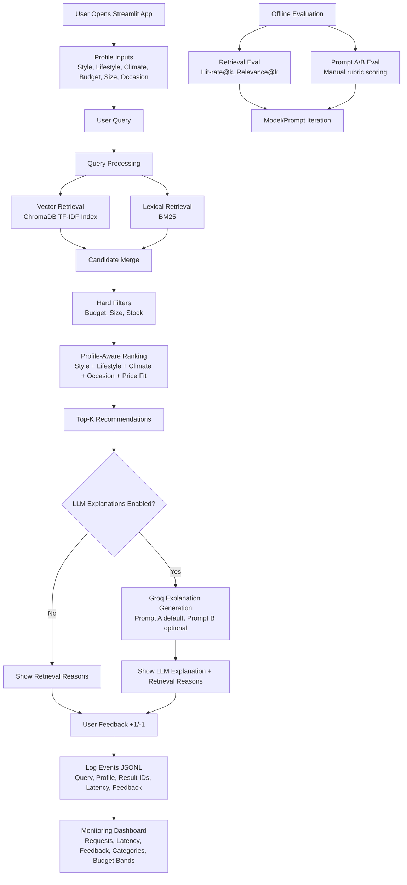

# 👗 LifeStyled AI

**Capstone project for the [DataTalks.Club LLM Zoomcamp](https://github.com/DataTalksClub/llm-zoomcamp).**

**An end-to-end production-style RAG application for personalized fashion recommendations based on user style, lifestyle, climate, budget, size, and occasion.**

**Live App:** https://lifestyled-ai.streamlit.app

[](https://www.python.org/)
[](https://streamlit.io/)
[](https://www.trychroma.com/)
[](https://en.wikipedia.org/wiki/Okapi_BM25)
[](https://groq.com/)
[](https://docs.astral.sh/uv/)
[](https://www.docker.com/)

### 📌 Table of Contents

1. [Problem Description](#problem-description)
2. [Current Project Status](#current-project-status)
3. [Demo Video](#demo-video)
4. [Step-by-Step Implementation Path](#step-by-step-implementation-path)
5. [System Architecture & Workflow](#system-architecture--workflow)
6. [Repository Structure](#repository-structure)
7. [Data](#data)
8. [Retrieval Flow](#retrieval-flow)
9. [Evaluation Plan](#evaluation-plan)
10. [Offline Evaluation Results](#offline-evaluation-results)
11. [Monitoring](#monitoring)
12. [Reproducibility](#reproducibility)
13. [Reviewer Quickstart](#reviewer-quickstart)
14. [Technology Choices](#technology-choices)
15. [Evaluation Criteria Mapping (Zoomcamp)](#evaluation-criteria-mapping-zoomcamp)
16. [Evaluation Criteria Checklist](#evaluation-criteria-checklist)
17. [Rubric Checklist (Current)](#rubric-checklist-current)
18. [Containerization](#containerization)
19. [Notes](#notes)


## Problem Description

Finding clothing that fits real-life constraints is harder than basic search can handle. People need recommendations that account for:

- personal style
- lifestyle (office, commute, travel, weekend)
- climate
- occasion
- budget
- size and stock

LifeStyled is a profile-aware fashion assistant that retrieves relevant products and explains why each recommendation fits the user.

## Current Project Status

- Profile-aware retrieval with vector and hybrid search
- Optional query rewrite + diversity rerank loop
- Streamlit app with recommendation flow and feedback logging
- Monitoring dashboard page with core charts and query table
- Retrieval and prompt evaluation scripts

## Demo Video

Recommended short walkthrough (60-120 seconds):

1. Open app and show profile + query inputs.
2. Run one recommendation query and show recommendations.
3. Submit feedback (+1/-1).
4. Open Monitoring page and show charts.

## Step-by-Step Implementation Path

1. Build index from catalog
2. Run hybrid retrieval
3. Rank results with profile signals
4. Add optional explanation layer
5. Log events and monitor trends

## System Architecture & Workflow



## Repository Structure

```text
.
├── app/
│   ├── streamlit_app.py
│   └── pages/01_monitoring.py
├── data/
│   ├── raw/products_seed.csv
│   └── eval/validation_queries.json
├── logs/
├── reports/
├── scripts/
├── src/lifestyled/
├── .env.example
├── Dockerfile
├── docker-compose.yml
└── README.md
```

## Data

Starter dataset: `data/raw/products_seed.csv`

Dataset compliance:

- This project does not use the DataTalksClub Zoomcamp FAQ documents.

## Retrieval Flow

1. Build vectors and lexical index from product catalog.
2. Retrieve candidates from vector and BM25 search.
3. Filter by budget, size, and stock.
4. Re-rank by profile fit.
5. Return top recommendations with reasons.

## Evaluation Plan

### Retrieval Evaluation

```bash
uv run env PYTHONPATH=src python scripts/evaluate_retrieval.py
```

Artifacts:

- `reports/retrieval_eval.json`
- `reports/retrieval_eval.md`

### LLM Evaluation

```bash
uv run env PYTHONPATH=src python scripts/evaluate_prompt_variants.py
uv run python scripts/score_prompt_variants.py
```

Artifacts:

- `reports/prompt_variant_outputs.json`
- `reports/prompt_variant_scoring.md`

## Offline Evaluation Results

Retrieval (k=5), from `reports/retrieval_eval.md`:

- Vector: hit-rate@5 = 1.0000, relevance@5 = 0.4792
- Hybrid: hit-rate@5 = 1.0000, relevance@5 = 0.5347
- Decision: hybrid is the default retrieval mode because it has higher relevance at the same hit-rate.

LLM output scoring, from `reports/prompt_variant_scoring.md`:

- Current scoring coverage: 0/40
- Recommendation status: insufficient_data
- Next step: fill manual_scores in `reports/prompt_variant_outputs.json` and rerun `scripts/score_prompt_variants.py`.

Full artifacts:

- `reports/retrieval_eval.md`
- `reports/retrieval_eval.json`
- `reports/prompt_variant_scoring.md`

## Monitoring

Events are logged to `logs/events.jsonl`.

Dashboard sections:

- Requests over time
- Avg response time over time
- Feedback trend
- Top categories requested
- Budget band distribution
- Optional diagnostics
- Table for queries

## Reproducibility

Dependency versions are pinned in `pyproject.toml` and `uv.lock`.

```bash
cp .env.example .env
uv sync
uv run env PYTHONPATH=src python scripts/build_index.py
uv run env PYTHONPATH=src streamlit run app/streamlit_app.py
```

## Reviewer Quickstart

```bash
cp .env.example .env
uv sync
uv run env PYTHONPATH=src python scripts/build_index.py
uv run env PYTHONPATH=src streamlit run app/streamlit_app.py
```

## Technology Choices

- Python 3.12+
- Streamlit
- ChromaDB
- BM25 (`rank-bm25`)
- scikit-learn TF-IDF
- Groq (optional)

## Evaluation Criteria Mapping (Zoomcamp)

- Problem description: this README
- Retrieval flow: `src/lifestyled/retrieval.py`
- Retrieval evaluation: `scripts/evaluate_retrieval.py`, `reports/retrieval_eval.md`
- LLM evaluation: `scripts/evaluate_prompt_variants.py`, `reports/prompt_variant_scoring.md`
- Interface: `app/streamlit_app.py`
- Ingestion: `scripts/build_index.py`, `src/lifestyled/ingestion.py`
- Monitoring: `app/pages/01_monitoring.py`
- Containerization: `Dockerfile`, `docker-compose.yml`

## Evaluation Criteria Checklist

- [x] Problem description
- [x] Retrieval flow
- [x] Retrieval evaluation
- [x] LLM evaluation
- [x] Interface
- [x] Ingestion pipeline
- [x] Monitoring
- [x] Containerization
- [x] Reproducibility

## Rubric Checklist (Current)

- [x] Hybrid retrieval
- [x] Re-ranking
- [x] Query rewriting

## Containerization

```bash
docker compose up --build
```

## Notes

- Live app is deployed at https://lifestyled-ai.streamlit.app
- Monitoring includes user feedback plus a dashboard with 5+ charts and a query table.