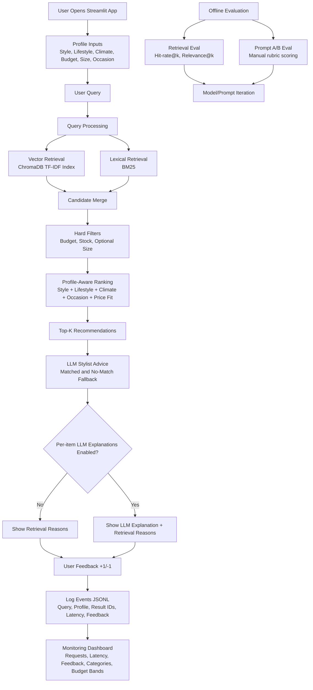

# 👗 LifeStyled AI

**Capstone project for the [DataTalks.Club LLM Zoomcamp](https://github.com/DataTalksClub/llm-zoomcamp).**

**An end-to-end production-style RAG application for personalized fashion recommendations based on user style, lifestyle, climate, budget, and occasion, with LLM stylist advice.**

**Live App:** https://lifestyled-ai.streamlit.app

Please be patient as it takes sometime for app to wake up :)

[](https://www.python.org/)
[](https://streamlit.io/)
[](https://www.trychroma.com/)
[](https://en.wikipedia.org/wiki/Okapi_BM25)
[](https://groq.com/)
[](https://docs.astral.sh/uv/)
[](https://www.docker.com/)

### 📌 Table of Contents

1. [Problem Description](#problem-description)
2. [Current Project Status](#current-project-status)
3. [Project Demo](#project-demo)
4. [Step-by-Step Implementation Path](#step-by-step-implementation-path)
5. [System Architecture & Workflow](#system-architecture--workflow)
6. [Repository Structure](#repository-structure)
7. [Data](#data)
8. [Retrieval Flow](#retrieval-flow)
9. [Evaluation Plan](#evaluation-plan)
10. [Offline Evaluation Results](#offline-evaluation-results)
11. [Monitoring](#monitoring)
12. [Reproducibility](#reproducibility)
13. [Reviewer Quickstart](#reviewer-quickstart)
14. [Evaluation Criteria Mapping (Zoomcamp)](#evaluation-criteria-mapping-zoomcamp)
15. [Evaluation Criteria Checklist](#evaluation-criteria-checklist)
16. [Rubric Checklist (Current)](#rubric-checklist-current)
17. [Containerization](#containerization)


## Problem Description

Finding clothing that fits real-life constraints is harder than basic search can handle. People need recommendations that account for:

- personal style
- lifestyle (office, commute, travel, weekend)
- climate
- occasion
- budget
- size and stock

LifeStyled is a profile-aware fashion assistant that retrieves relevant products and explains why each recommendation fits the user.

## Current Project Status

- Profile-aware retrieval with vector and hybrid search
- Optional query rewrite + diversity rerank loop
- Streamlit app with a simplified end-user recommendation flow and feedback logging
- LLM-generated stylist advice for both matched and no-match queries
- Size filtering is optional (improves recall when size is not selected)
- Monitoring dashboard page with core charts and query table
- Retrieval and prompt evaluation scripts

## Project Demo 


Short walkthrough: profile setup, recommendation query, feedback logging, and monitoring dashboard review.

## Step-by-Step Implementation Path

1. Build index from catalog
2. Run default hybrid retrieval
3. Rank results with profile signals and optional size filtering
4. Add LLM stylist advice and optional per-item explanations
5. Log events and monitor trends

## System Architecture & Workflow



## Repository Structure

```text
.
├── .devcontainer/
├── app/
│   ├── streamlit_app.py
│   └── pages/
│       └── 01_monitoring.py
├── data/
│   ├── raw/
│   │   └── products_seed.csv
│   ├── eval/
│   │   └── validation_queries.json
│   └── processed/
├── logs/
│   └── events.jsonl
├── reports/
│   ├── retrieval_eval.json
│   ├── retrieval_eval.md
│   ├── prompt_variant_outputs.json
│   └── prompt_variant_scoring.md
├── scripts/
│   ├── build_index.py
│   ├── evaluate_retrieval.py
│   ├── evaluate_prompt_variants.py
│   └── score_prompt_variants.py
├── src/
│   └── lifestyled/
│       ├── agentic.py
│       ├── config.py
│       ├── explanations.py
│       ├── ingestion.py
│       ├── models.py
│       └── retrieval.py
├── src/
│   └── lifestyled_ai/
│       └── __init__.py
├── .env.example
├── Dockerfile
├── docker-compose.yml
├── project.md
├── pyproject.toml
├── requirements.txt
├── uv.lock
└── README.md
```

## Data

Starter dataset: `data/raw/products_seed.csv`

Dataset compliance:

- This project does not use the DataTalksClub Zoomcamp FAQ documents.

## Retrieval Flow

1. Build vectors and lexical index from product catalog.
2. Retrieve candidates from vector and BM25 search.
3. Filter by budget and stock, and by size only if the user selected a size.
4. Re-rank by profile fit.
5. Return top recommendations with reasons.

Runtime defaults used in the app are selected from offline experiments:

- Retrieval mode shown to end users: `hybrid` (default in production UI)
- Explanation style shown to end users: internal default selected via prompt-variant evaluation
- Agentic rewrite/rerank loop: enabled by default in production UI
- Per-item explanation generation: disabled by default to reduce latency and API usage

The `Search mode` and prompt-variant controls are evaluation/tuning knobs and are not presented as end-user controls in the primary UI.

## Evaluation Plan

### Retrieval Evaluation

```bash
uv run env PYTHONPATH=src python scripts/evaluate_retrieval.py
```

Artifacts:

- `reports/retrieval_eval.json`
- `reports/retrieval_eval.md`

### LLM Evaluation

```bash
uv run env PYTHONPATH=src python scripts/evaluate_prompt_variants.py
uv run python scripts/score_prompt_variants.py
```

Artifacts:

- `reports/prompt_variant_outputs.json`
- `reports/prompt_variant_scoring.md`

These scripts are used offline to compare prompt behavior and choose app defaults. They are not intended as user-facing runtime controls.

## Offline Evaluation Results

Retrieval benchmark (k = 5), from `reports/retrieval_eval.md`:

### Benchmark Results Table

| Retrieval Strategy | Avg Hit Rate@5 | Avg Relevance@5 | Description |
|---|---:|---:|---|
| Vector Search Only | 1.0000 | 0.4792 | Captures semantic similarity, but with lower final relevance than hybrid on the validation set. |
| Hybrid Search (Vector + BM25) | 1.0000 | 0.5347 | Combines semantic and keyword matching, improving relevance while keeping perfect hit rate. |

Decision: Hybrid is the default retrieval mode because it gives higher relevance at the same hit rate.

Product decision: this retrieval choice is applied as an internal app default to reduce UI complexity for end users.

Run retrieval benchmark locally:

```bash
uv run env PYTHONPATH=src python scripts/evaluate_retrieval.py
```

LLM output evaluation status, from `reports/prompt_variant_scoring.md`:

| Metric | Value |
|---|---|
| Scoring coverage | 40/40 |
| Prompt A overall | 4.4 |
| Prompt B overall | 4.0 |
| Recommendation status | A |
| Rationale | Prompt A scored higher on relevance, groundedness, and personalization; Prompt B scored higher on clarity. |

Run LLM evaluation locally:

```bash
uv run env PYTHONPATH=src python scripts/evaluate_prompt_variants.py
uv run python scripts/score_prompt_variants.py
```

Full artifacts:

- `reports/retrieval_eval.md`
- `reports/retrieval_eval.json`
- `reports/prompt_variant_scoring.md`

## Monitoring

Events are logged to `logs/events.jsonl`.

Dashboard sections:

- Requests over time
- Avg response time over time
- Feedback trend
- Top categories requested
- Budget band distribution
- Optional diagnostics
- Table for queries

Note: The monitoring page also tracks whether agentic retrieval and LLM explanations were enabled for each interaction.

## Reproducibility

Dependency versions are pinned in `pyproject.toml` and `uv.lock`.

```bash
cp .env.example .env
uv sync
uv run env PYTHONPATH=src python scripts/build_index.py
uv run env PYTHONPATH=src streamlit run app/streamlit_app.py
```

## Reviewer Quickstart

```bash
cp .env.example .env
uv sync
uv run env PYTHONPATH=src python scripts/build_index.py
uv run env PYTHONPATH=src streamlit run app/streamlit_app.py
```

## Evaluation Criteria Mapping (Zoomcamp)

This project satisfies the Zoomcamp evaluation criteria as mapped below.

| Rubric Criteria | Project Feature and Implementation File |
|---|---|
| Problem description | Clear problem statement and scope in this README. |
| Retrieval flow | Profile-aware vector + BM25 retrieval and ranking in [src/lifestyled/retrieval.py](src/lifestyled/retrieval.py) with optional orchestration in [src/lifestyled/agentic.py](src/lifestyled/agentic.py). |
| Retrieval evaluation | Benchmark script in [scripts/evaluate_retrieval.py](scripts/evaluate_retrieval.py) with reported metrics in [reports/retrieval_eval.md](reports/retrieval_eval.md) and [reports/retrieval_eval.json](reports/retrieval_eval.json). |
| LLM evaluation | Prompt variant generation and scoring via [scripts/evaluate_prompt_variants.py](scripts/evaluate_prompt_variants.py) and [scripts/score_prompt_variants.py](scripts/score_prompt_variants.py), results in [reports/prompt_variant_scoring.md](reports/prompt_variant_scoring.md). |
| Interface | Interactive Streamlit UI in [app/streamlit_app.py](app/streamlit_app.py). |
| Ingestion pipeline | Index build pipeline in [scripts/build_index.py](scripts/build_index.py) and [src/lifestyled/ingestion.py](src/lifestyled/ingestion.py). |
| Monitoring | Feedback logging in [app/streamlit_app.py](app/streamlit_app.py) and dashboard charts/table in [app/pages/01_monitoring.py](app/pages/01_monitoring.py). |
| Containerization | Container setup in [Dockerfile](Dockerfile) and [docker-compose.yml](docker-compose.yml). |
| Reproducibility | Pinned dependencies in [pyproject.toml](pyproject.toml) and [uv.lock](uv.lock), plus run steps in this README. |

## Evaluation Criteria Checklist

- [x] Problem description
- [x] Retrieval flow
- [x] Retrieval evaluation
- [x] LLM evaluation
- [x] Interface
- [x] Ingestion pipeline
- [x] Monitoring
- [x] Containerization
- [x] Reproducibility

## Rubric Checklist (Current)

- [x] Hybrid retrieval
- [x] Re-ranking
- [x] Query rewriting

## Containerization

```bash
docker compose up --build
```